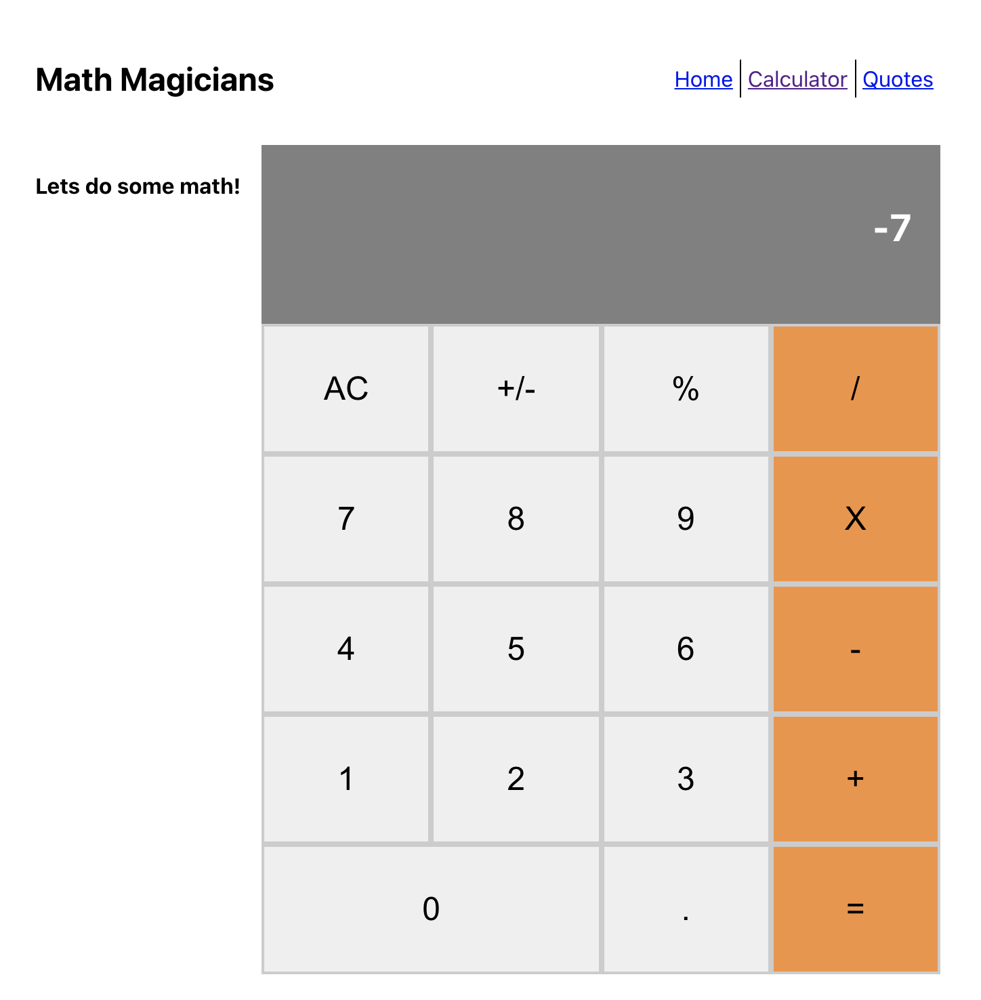
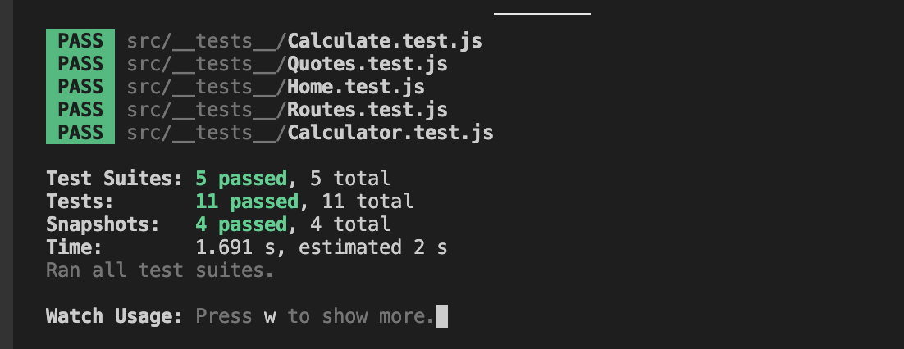

# Calculator App

## About

Create a basic react app using `create-react-app ` command

## Calculator

## Built With

- React

# Setup

[Clone App](https://github.com/nganifaith/React_Calculator).

- cd to React_Calculator
- run `npm install`
- run `git checkout feature`
- run `npm start` app opens on [http://localhost:3000](http://localhost:3000)

## Test

- run test `npm test`
  

### Prerequisites

Basic knowledge about React:

## Live site

[Live](https://boiling-anchorage-63054.herokuapp.com/)

## Author

👤 **Ngani Faith**

- GitHub: [@nganifaith](https://github.com/nganifaith)
- Twitter: [@Bright_Ngani](https://twitter.com/bright_ngani)
- LinkedIn: [Ngani Faith](https://www.linkedin.com/in/ngani-faith/)

## 🤝 Contributing

Contributions, issues, and feature requests are welcome!

Feel free to check the [issues page](https://github.com/nganifaith/JS_ToDOList/issues).

## Show your support

Give a ⭐️ if you like this project!

## 📝 License
